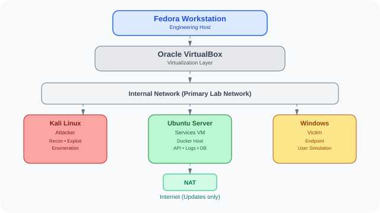

# 🏗️ Laboratory Architecture 

 
> Laboratory Architecture of Project Sentinel 

 --- 
 

## Purpose 

 
Define the standard technical architecture adopted by Project Sentinel laboratories. 

 
This document establishes how virtual machines, networks, services, and future containerized applications are organized to ensure isolation, reproducibility, scalability, and efficient resource utilization. 

 

--- 

 
## Design Principles 
 

- Isolation 

- Modularity 

- Reproducibility 

- Observability 

- Resource Efficiency 

- Design for Evolution 

 
--- 
 

## Architecture Overview 
 

--- 

 ## Infrastructure Layers 

Virtual machines model infrastructure. 

Containers model services. 

Project Sentinel intentionally separates these responsibilities so that infrastructure remains stable while applications can be recreated, updated, or removed independently. 
 

### Host Layer 

Fedora Workstation is the engineering host of Project Sentinel. 

It is responsible for source code, documentation, Git operations, VS Code, Docker, VirtualBox and overall laboratory management. No cybersecurity laboratory is executed directly on the host operating system. 
 

### Virtualization Layer 

 
Oracle VirtualBox provides the virtualization layer of Project Sentinel. 

Virtual machines represent complete systems within the laboratory, including the attacker (Kali Linux), the services server (Ubuntu Server), and the victim endpoint (Windows). 
 

### Network Layer 
 

The Internal Network is the primary communication channel between laboratory machines. 

 
It provides complete isolation from the physical network while allowing controlled communication between virtual machines. NAT is used only when Internet access is required for updates or package installation. 
 

### Server Layer 

 
Ubuntu Server acts as the infrastructure server of the laboratory. 

 

Rather than hosting user workloads directly, it provides the platform where future services will run, including Docker containers, APIs, databases, telemetry collectors, and monitoring components. 
 

### Endpoint Layer 
 

Kali and Windows responsibilities. 

Kali Linux será a maquina atacante enquanto a Windows será a vitima. 

 
--- 
 

## Network Topology 

 
| Component | Network | Purpose | 

|-----------|---------|----------| 

| Kali | Internal | Attacker | 

| Ubuntu | Internal + NAT | Services | 

| Windows | Internal | Victim | 

 
--- 

 
## Resource Model

The initial laboratory architecture is designed around the current 16 GB host capacity.

| Component     | Allocated RAM | Role                    |
| ------------- | ------------: | ----------------------- |
| Fedora Host   |          5 GB | Engineering workstation |
| Kali Linux    |          3 GB | Attacker                |
| Ubuntu Server |          4 GB | Services VM             |
| Windows       |          4 GB | Victim endpoint         |

> Total allocated to virtual machines: **11 GB**.
> The remaining memory is reserved for the Fedora host and background services. 

--- 

## Future Expansion 

 
- Wazuh 

- Docker Compose 

- PostgreSQL 

- Python API 

- SOAR 

- Threat Hunting 
 

--- 
 

## Architectural Decisions 

 

The current architecture was designed around four engineering objectives: 

 
- Isolation between laboratory and physical environments. 

- Reproducibility through standardized infrastructure. 

- Resource efficiency for 16 GB hardware. 

- Evolution without requiring architectural redesign. 

--- 

 
## Version 
 

Laboratory Architecture v0.1 